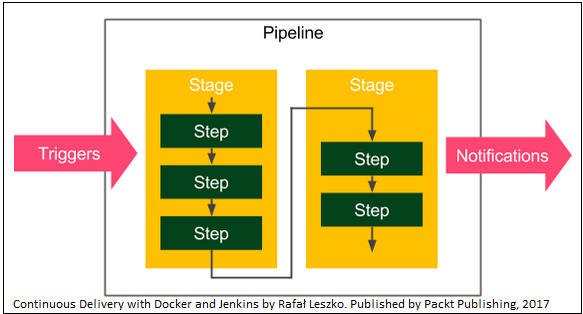
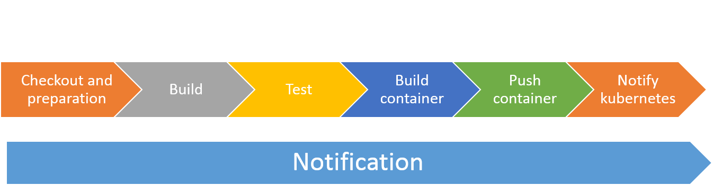

## Continuous Integration / continuous Delivery – using Jenkins:
Jenkins is a simple, extensible, and user friendly open source tool that provides continuous integration and continuous delivery services for application development.
For installation procedures, please see infrastructure provisioning section.
## Plugins:
Jenkins is highly plugin-oriented, which means that a lot of features are delivered by the use of plugins. They can extend Jenkins almost in the unlimited way, which, taking into consideration the large community, is one of the reasons why Jenkins is such a successful tool. The plugins used for this demo includes:
1- Github
2- Maven
3- Pipeline
4- Blue Ocean
5- Slack 
## Pipeline as a code
Jenkins supports pipelines as code that uses domain-specific language (DSL) to model application delivery pipelines as code.

## Triggers:
Out of the box, Jenkins supports three categories of triggers:
1- External triggers: In this case, a remote system (Such as SCM “Github for instance”) calls Jenkins whenever new commit happen in the repository. Obviously, in this case Jenkins has to be accessible (inbound access) from SCM server.
2- Pulling SCM: Jenkins pull SCM periodically for any new commit.
3- Scheduled build: using cron syntax, you can program Jenkins to trigger the pipeline periodically.

## Pipeline stages:

  
1- Checkout and preparation: In this stage, the pipeline will check out the latest commit from the repository, and set the required environments variables for the pipeline.
2- Build: In the stage, the source code will be build.
3- Test: If there is any test target defined / implemented, it’ll be executed at this stage.
4- Build container: At this stage, the container will be built.
5- Push container: The built container image will be pushed to the container registry accessible by next stage (integration test environment for instance).
6- Notify Kubernetes: As we have deployed the container using Kubernetes, we’ll notify it that there is a new version of the container image is available. 
## Notification:
Jenkins support a lot of notification mechanisms, including but not limited to e-mail, SMS and set of group chat solutions. In this demo, we’ll use Slack as notification platform.
